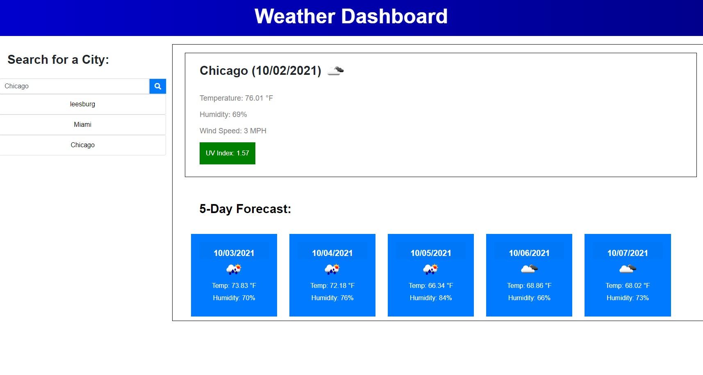

# Weather-Dashboard

https://mike-lane.github.io/Weather-Dashboard/

I have been tasked with creating a weather dashboard that meets the following criteria:
<ul>
    <li>Dashobard will have an input for city name</li>
    <li>When a search is conducted, the user is presented with current and future conditions for that city and that city is added to the search history.</li>
    <li>When the user views the current weather conditions for a city, they are presented with the city name, the date, an icon representation of weather conditions, the temperature, the humidity, the wind speed, and the UV index</li>
    <li>UV index is to be respresented with a color that indicates whether the conditions are favorable (green), moderate (yellow), or severe (red).</li>
    <li>When the user views future weather conditions for a city,
they are presented with a 5-day forecast that displays the date, an icon representation of weather conditions, the temperature, the wind speed, and the humidity.</li>
    <li>When the user clicks a city in the serach history, they are again presented with curent and future conditions for that city.</li>
</ul>